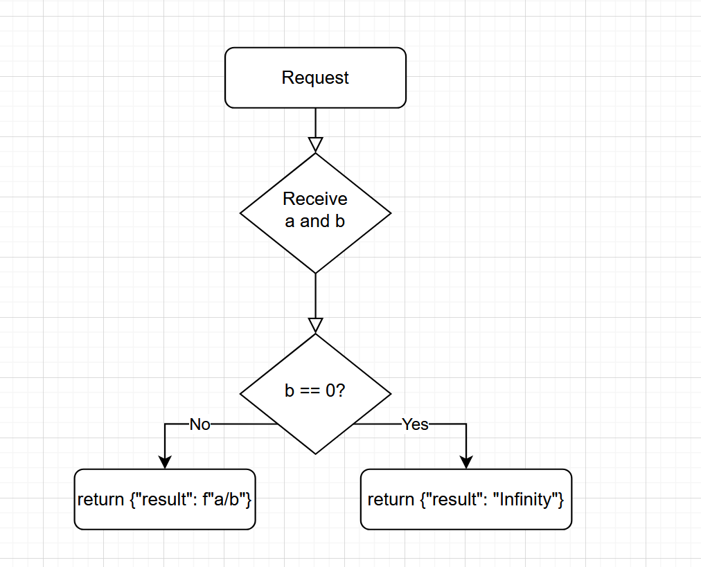

## Automated API testing using FastAPI, Startlette TestClient and Git Hooks

### Motivation

Automation of testing is essential in DevOps, since it largely reduces the time taken to manually find pre-existing bugs, as well as significantly lowers the risk of accidentally introducing new ones. Moreover, this is especially vital in the area of API testing, in order to avoid regression bugs and ensure consistent performance and reliability across different environments and versions.

### Intended Learning Outcomes

After this tutorial, you will learn how to:

- Set up a simple API with FastAPI.
- Interact with API endpoints.
- Implement own API test cases with Starlett TestClient and pytest.
- Test API without starting a server.
- Set up Git hooks for your API.
- Implement regression testing and automation strategies to validate new changes in the API.
  <!-- blablablabla -->
  <!-- - Setting up the required tools in the environment and creating a git repository
  <!-- - Initializing a sample FastAPI project and running the API with Uvicorn
  <!-- - Reviewing provided test cases for the sample API. -->
  <!-- - Configuring Git Hooks to run provided Starlette TestClient test cases in automatic manner. -->
  <!-- - Updating source code of the API -->
  <!-- - Automation and regression testing of the new changes to the API -->

### Background

- FastAPI: A modern and fast web framework for building APIs with Python. Well-suited for building REST APIs with asynchronous structure.
- Starlett TestClient: A lightweight toolkit for FastAPI, provides a way to simulate requests to your FastAPI with built-in testing client.
- Pytest: A popular testing framework for python, simple but powerful.
- Git Hooks: Scripts that run automatically at certain points in Git workflow, in our case, before any change to the API source code becomes visible.

  
