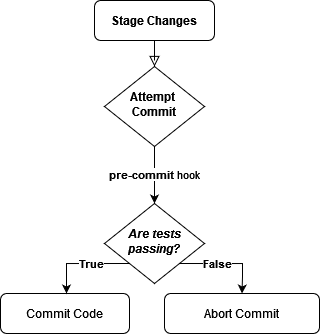

## Stage and Commit Changes

Now, switch back to the main app directory.

`cd /root/filesystem/app`{{exec}}

Let's try Commit some changes to the API including the faulty endpoint

`git add .`{{exec}}

`git commit -m "message"`{{exec}}

<p align="center">
  
</p>


## Verification with Git

We see that our tests failed, therefore the commit also fails. Let' verify it with Git:

`git log`{{exec}}

 It should print 
 
```fatal: your current branch 'master' does not have any commits yet```