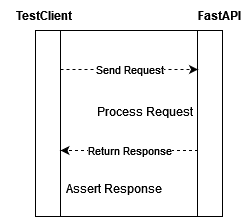

## Review Provided Test Cases

First, let's examine the provided test cases to ...

`cat tests/test_example.py`{{exec}}

The example test cases demonstrate how to use **FastAPI**'s **TestClient** to test the functionality of the API endpoints by **asserting** expected **status codes** and **response content**.

<!-- We see that test cases are simply requesting the root endpoint the example endpoint, the test cases are through when we get the responses with status code = 200, indicating the request was successful. -->

  

The diagram illustrates the interaction between **FastAPI** and the **Starlette TestClient**, showing the process of **sending** a **request**, **processing** it, **returning** a **response** and **asserting** it against the **expected result**.

## Run the Example Test

Now run the example test

`pytest tests/test_example.py`{{exec}}

**Note**: Observe that the example test for the `/divide` endpoint fails  due to a `ZeroDivisionError`.
